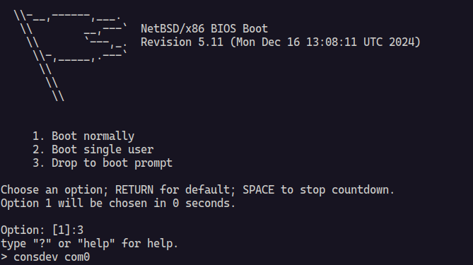

# NetBSD-UP 🚀

A simple command-line tool to start NetBSD virtual machines using QEMU with
sensible defaults.



## ✨ Features

- 🖥️ **Easy NetBSD VM setup**: Launch NetBSD virtual machines with a single command
- 📥 **Automatic ISO download**: Downloads NetBSD ISO images from official CDN
- 🏷️ **Version-aware**: Specify NetBSD versions and automatically construct
  download URLs
- 🔄 **Flexible input**: Support for local ISO files, URLs, or version numbers
- ⚙️ **Configurable VM settings**: Customize CPU, memory, cores, and disk options
- ⚡ **KVM acceleration**: Automatically enables hardware virtualization for better
  performance
- 🌐 **Network forwarding**: SSH access via port 2222 on the host
- 💻 **Serial console**: No GUI required - works entirely in terminal

## 📋 Requirements

- 🦕 [Deno](https://deno.com/) runtime
- 🖥️ QEMU with KVM support
- 📥 `curl` for downloading ISO images

## 🚚 Installation

```bash
# Clone the repository
git clone https://github.com/tsirysndr/netbsd-up.git
cd netbsd-up

# Make it executable
chmod +x main.ts
```

Run the following command to install the CLI:

```bash
deno install -A -g -r -f --config deno.json ./main.ts -n netbsd-up
```

## 🎯 Usage

### ⭐ Basic Usage

Start a NetBSD 10.1 VM with default settings:

```bash
./main.ts
```

### 🏷️ Specify NetBSD Version

```bash
./main.ts 10.1
./main.ts 9.3
```

### 📁 Use Local ISO File

```bash
./main.ts /path/to/netbsd.iso
```

### 🌐 Download from Custom URL

```bash
./main.ts https://cdn.netbsd.org/pub/NetBSD/images/10.1/NetBSD-10.1-amd64.iso
```

## 🖥️ Console Setup

When NetBSD boots, you'll see the boot menu. For the best experience with the
serial console:

1. **🔧 Select option `3. Drop to boot prompt`**
2. **⚙️ Configure console output:**
   ```
   consdev com0
   boot
   ```

This enables proper console redirection to your terminal.

### ⚙️ Advanced Configuration

```bash
# Custom CPU, memory, and cores
./main.ts --cpu host --memory 4G --cpus 4

# Save downloaded ISO to specific location
./main.ts --output netbsd-10.1.iso

# Use existing disk image
./main.ts --drive vm-disk.img --disk-format qcow2
```

## 🛠️ Command Line Options

| Option          | Short | Description                    | Default        |
| --------------- | ----- | ------------------------------ | -------------- |
| `--output`      | `-o`  | Output path for downloaded ISO | Auto-generated |
| `--cpu`         | `-c`  | CPU type to emulate            | `host`         |
| `--cpus`        | `-C`  | Number of CPU cores            | `2`            |
| `--memory`      | `-m`  | Amount of VM memory            | `2G`           |
| `--drive`       | `-d`  | Path to VM disk image          | None           |
| `--disk-format` |       | Disk image format              | `raw`          |

## 📚 Examples

### ⭐ Default NetBSD VM

```bash
./main.ts
```

Starts NetBSD 10.1 with 2 CPU cores and 2GB RAM.

### 🚀 High-Performance Setup

```bash
./main.ts --cpus 8 --memory 8G --cpu host
```

### 💾 Development Environment with Persistent Disk

```bash
# Create a disk image first
qemu-img create -f qcow2 netbsd-dev.qcow2 20G

# Start VM with the disk
./main.ts --drive netbsd-dev.qcow2 --disk-format qcow2
```

### 🔢 Specific versions

```bash
./main.ts 10.1
./main.ts 9.4
```

## 🌐 Networking

The VM automatically sets up network forwarding:

- 🔑 SSH access: `ssh -p 2222 root@localhost`
- �️ The VM uses QEMU's user-mode networking

## 📋 Version Format

NetBSD-UP recognizes version strings in the format:

- 🔢 `MAJOR.MINOR` (e.g., `10.1`, `9.3`)

⚡ The tool automatically constructs the download URL for the official NetBSD
release ISO.

## ⚙️ Default Settings

- **🏷️ NetBSD Version**: 10.1
- **🖥️ CPU**: host (uses host CPU features)
- **💾 Memory**: 2GB
- **⚡ CPU Cores**: 2
- **💿 Disk Format**: raw
- **🌐 Network**: User-mode with SSH forwarding

## 📄 License
See [LICENSE](LICENSE) file for details.

## Contributing 🤝
Contributions are welcome! Please feel free to submit issues and pull requests.

> [!NOTE]
>
> This tool is designed for development and testing purposes. For production
> NetBSD deployments, consider using proper installation methods.
